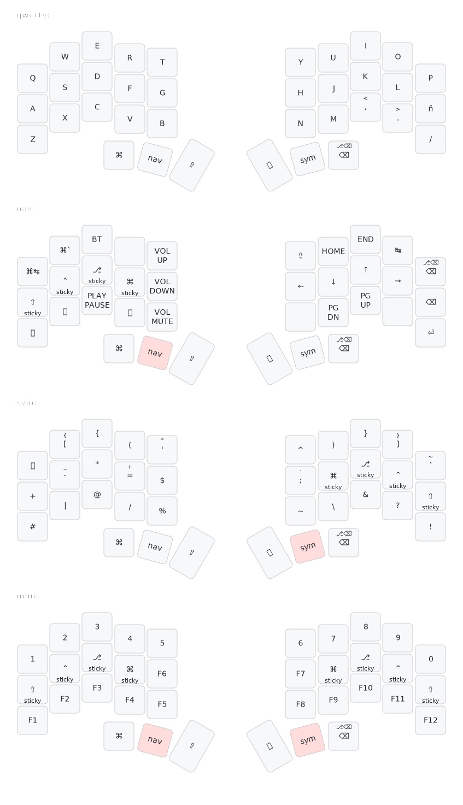

# Temper ZMK Config

This is my personal ZMK config for the [temper](https://github.com/raeedcho/temper) keyboard.

Some notes about this config:
- Four main layers.
- Navigation layer has vim-like arrow keys.

